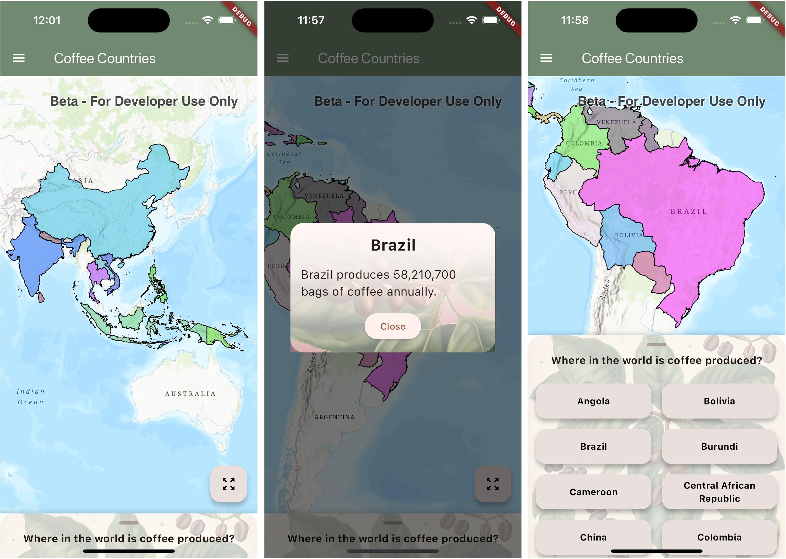

# coffee_crib

A cross platform mobile app for iOS and Android that shows the largest coffee producing countries in the world. 

This app is built with the [ArcGIS Maps SDK for Flutter (beta)](https://www.esri.com/arcgis-blog/products/developers/announcements/announcing-arcgis-maps-sdk-for-flutter-beta/).

## Running the app

The app can be run on an iOS or Android simulator or device. 

- Open the project in VSCode
- Ensure a simulator is running or a device is connected to your development machine
- Run or debug the app to launch it

## Getting Started

This project is a starting point for a Flutter application.

A few resources to get you started if this is your first Flutter project:

- [Lab: Write your first Flutter app](https://docs.flutter.dev/get-started/codelab)
- [Cookbook: Useful Flutter samples](https://docs.flutter.dev/cookbook)

For help getting started with Flutter development, view the
[online documentation](https://docs.flutter.dev/), which offers tutorials,
samples, guidance on mobile development, and a full API reference.
